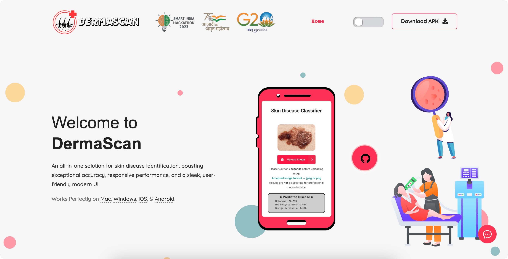
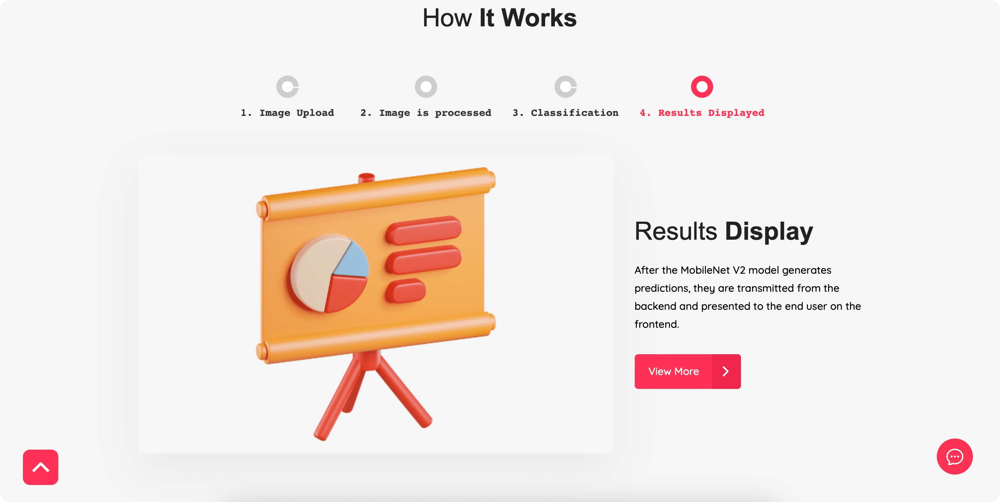
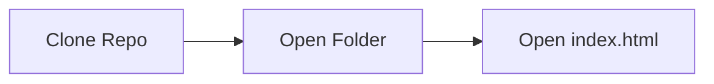

## DermaScan: Advanced Skin Lesion Classifier with Dermatology Chatbot


  <p>
    <ul>
      <li>Welcome to the DermaScan web app GitHub repository, your gateway to a cutting-edge skin lesion and disease classifier.</li>
      <li>Leveraging Harvard's Ham10000 dataset and the robust MobileNet V2 model, this system boasts an impressive accuracy rate of 89%.</li>
      <li>But that's not all – we've integrated "Derma" a dermatology chatbot powered by GPT-3.5 Turbo with internet access, to provide insightful information and guidance.</li>
      <li>Moreover, our app also connects you with the nearest doctors through an intuitive API, and offers suggestions for relevant medical articles. Explore the future of dermatological diagnostics and treatment right here!</li>
    </ul>


> [!IMPORTANT]
> These results are for informational purposes only; consult a healthcare professional for accurate medical advice.

 ## Build Status
 [](https://app.netlify.com/sites/derma-scan/deploys)

 ## Preview

<br/>
<br/>

<p align="center">
  
</p>

<br/>

 ## Current Tech Stack 🔻
<div style="display: inline_block"><br>
  
  
  
  
  
  
  
  
  
  
  
  
  
  
  
  
</div>
  
<div><h2><strong>Developers of this repository 🔻</strong></h2></div>

<table align="center">
<tr align="center">
<td>

**ΛDIƬYΛ VΣЯMΛ**

<p align="center">

</p>
<p align="center">
<a href = "https://github.com/ADITYAVOFFICIAL"></a>
<a href = "https://www.linkedin.com/in/aditya-verma-real/">

</a>
<a href = "https://medium.com/@adityaver">

</a>
</p>
</td>

</table>

 ## Installation
 <div>
 <p>Before running the Jupyter Notebook for the model, make sure to install the dependencies listed in the 'requirements.txt' file.</p>
   
   ```
   pip install -r requirements.txt
   ```

<p>Running website on Local Host</p>




 </div>

 ## Current Contributors 🔻
<div align="center">
  <a href="https://github.com/ADITYAVOFFICIAL/Skin-Disease-Classifier/graphs/contributors">
  
</a>
</div>
